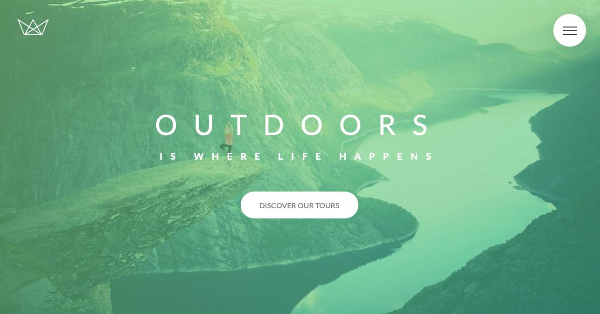
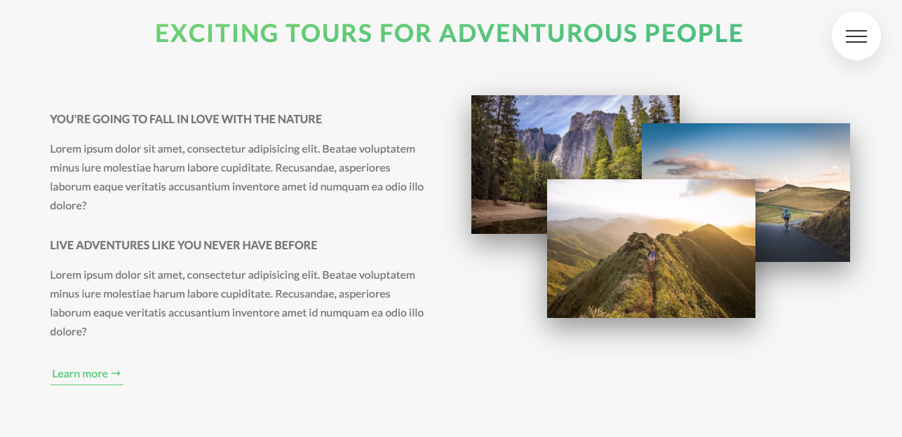
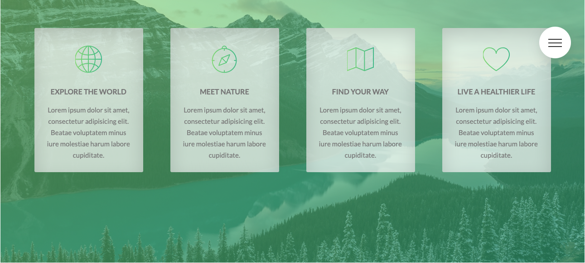
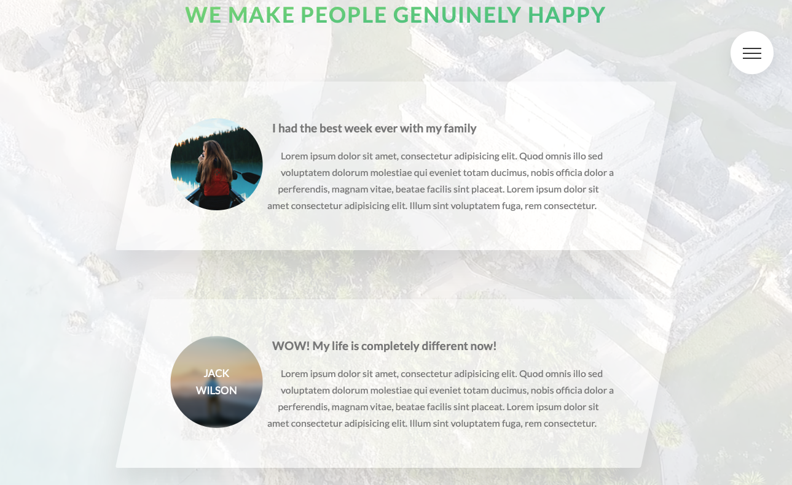
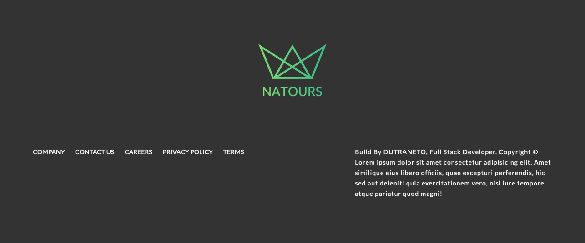
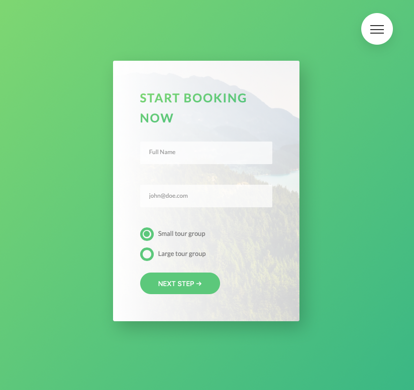

# Natours

## Natours is a front-end project based on PSD design

### Front-end

- HTML
- JavaScript (jQuery)
- CSS & SASS
- Responsive Design

---

### npm dev-dependencies

- autoprefixer
- concat
- node-sass
- npm-run-all
- postcss-cli

---

## Live Demo

### https://dutraneto.gitlab.io/2018-frontend-natours

---

### Screenshots

### TODO

🔘 Create a PT-BR to EN language switching

🔘 Create a nigth mode vision switching

🔘 Create a integration to Travis
